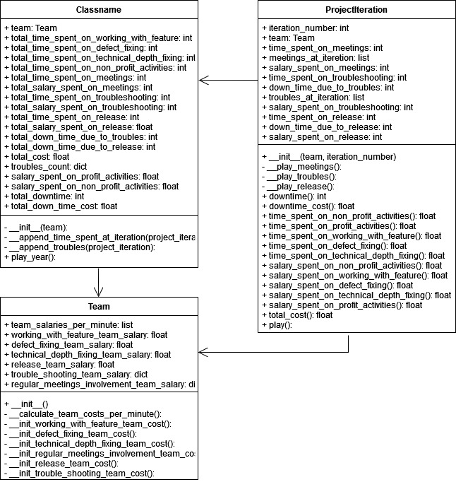

# Project Simulator
The aim of this project is to simulate IT project life at the year track and compare results of simulations with 
different input data in report file.
## Configuration
Configuration is defined in [config.py](config.py), where settings are defined mostly in dicts and constants. 
In the [main.py](main.py) file we could override configuration for different simulations
## Report
After launching different simulations for different cases, we could generate report like [this](generated_reports/report.md) 
## Class Diagram
